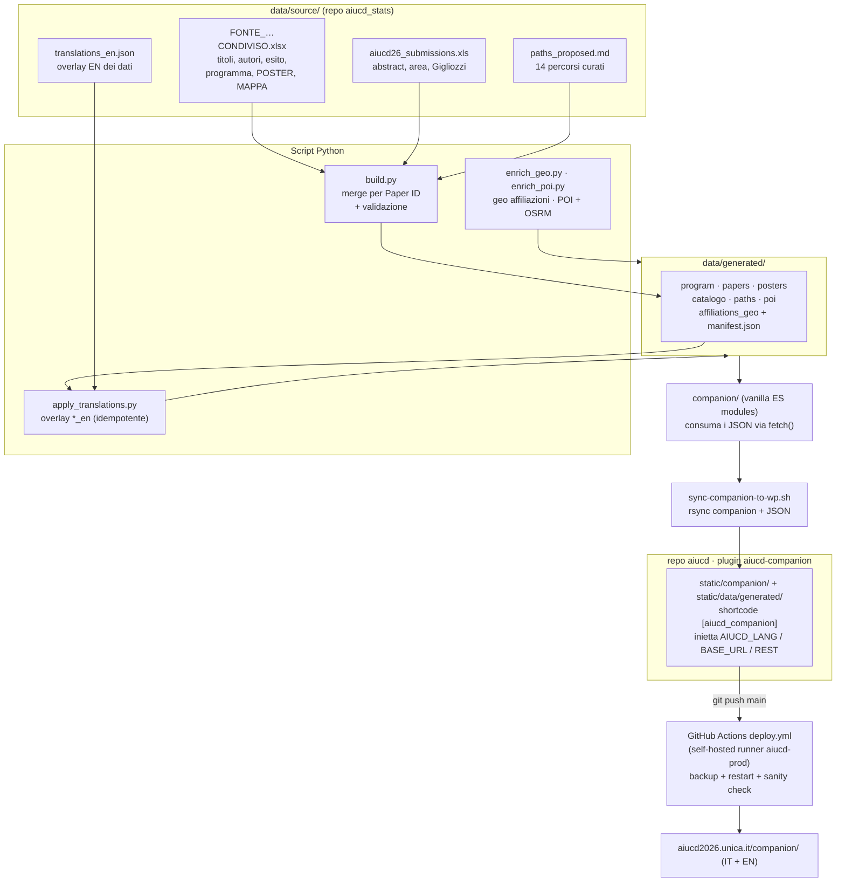

# 02 · Architettura

## Principi

L'architettura del Companion segue tre principi:

1. **Statico per scelta.** L'app è HTML + CSS + JavaScript vanilla in **ES modules
   nativi**, senza framework e senza bundler. Le uniche dipendenze runtime sono
   librerie da CDN (Leaflet + markercluster per le mappe, D3 per il grafo poster,
   Chart.js per le Cifre) e i font Google (Cardo + Inter). Il risultato si mantiene
   nel tempo, non invecchia con le mode dei framework e si serve come file statici.
2. **I dati separati dal codice.** Tutto il contenuto del convegno è in file JSON
   pre-generati da una pipeline Python; il frontend li carica via `fetch()` e li
   indicizza in memoria. Aggiornare il programma non richiede di toccare il codice.
3. **Lo stato live è client-side.** Il tempo si calcola solo dal browser
   (`new Date()`), mai dal server: l'hosting non influenza in alcun modo il
   comportamento "live".

## Composizione del frontend

L'app è una **singola pagina** a navigazione tab. Il bootstrap (`app.js`) carica il
dizionario i18n, instrada le tab via hash, carica i dati e monta le viste. Ogni
sezione è un modulo ES indipendente:

| Modulo | Responsabilità |
|---|---|
| `app.js` | Entry point: routing tab, indicatore live, drawer/overlay, eventi cross-tab |
| `data.js` | Caricamento dei JSON + definizione delle 6 aree tematiche |
| `livestate.js` | Calcolo dello stato live, countdown, parsing orari TZ-aware (Europe/Rome), clock-skew check |
| `program-view.js` | Griglia tempo × aula + live snapshot + linea "ora" |
| `catalog-view.js` | Esplora: ricerca, filtri, mappa affiliazioni |
| `poster-view.js` | Galleria poster (grafo D3) |
| `mappa-view.js` | Sede: pianta schematica con stato live delle aule |
| `cagliari-view.js` | Esplora Cagliari: POI + routing |
| `numeri-view.js` | Cifre: dashboard Chart.js |
| `path-view.js` | Drawer agenda + overlay percorsi |
| `noa-drawer.js`, `avatar.js`, `noa-fab-global.js` | Assistente Noa |
| `agenda.js` | Persistenza agenda (localStorage + cookie server-set) |
| `talk-modal-v2.js`, `drawer-controller.js`, `calendar-*.js` | Modale, drawer, export calendario |
| `i18n.js` | Dizionario `t(key)`, helper `field()` per campi `*_en`, formattazione date/aule |

## Integrazione con WordPress

Il sito istituzionale è un **WordPress** (Full Site Editing, child theme di
`twentytwentyfour`) con **Polylang** già configurato per IT/EN. Dopo aver valutato
cinque opzioni (sottocartella Apache, iframe, page template, plugin dedicato,
sottodominio), la scelta è caduta su un **plugin WordPress dedicato `aiucd-companion`**:

- monta il Companion sotto un **permalink controllato e Polylang-aware** (`/companion/`
  in IT, l'equivalente tradotto in EN) tramite shortcode `[aiucd_companion]`;
- pacchettizza gli **statici** (markup + asset) e i **JSON** in `static/`, serviti dal
  plugin, isolati dal tema;
- inietta nel runtime la lingua attiva (`window.AIUCD_LANG`), la base URL degli asset
  (`window.AIUCD_BASE_URL`), la base URL dei dati (`window.AIUCD_DATA_URL`) e
  l'endpoint REST dell'agenda (`window.AIUCD_REST_AGENDA`);
- gestisce il **cache-busting** dei JSON combinando `manifest.json → version` con
  l'`mtime` di `app.js`, così ogni nuova build invalida automaticamente la cache.

Questa scelta evita l'iframe (deep-linking e UX mobile integri), riusa la pipeline di
deploy esistente e si disattiva in modo pulito. In standalone (server statico, per il
QA) gli stessi moduli funzionano con path relativi: le variabili `window.AIUCD_*`
sono semplicemente assenti.

Due mu-plugin completano l'integrazione a livello di sito:

- `aiucd-site-widgets` ospita nell'header il contatore "★ Il mio AIUCD26" e un
  countdown verso l'apertura, sincronizzati con l'agenda e con lo stato live.
- `aiucd-pwa` rende il Companion **installabile**: serve via endpoint virtuali un
  *web manifest* lang-aware (`/aiucd-companion.webmanifest`) e un **service worker**
  (`/aiucd-companion-sw.js`) con caching a runtime e fallback offline, e inietta la
  UI "Installa l'app".

## Bilinguismo (IT/EN)

L'italiano è la **single source of truth**; l'inglese è un overlay non distruttivo.

- **Stringhe UI**: dizionari piatti `assets/i18n/it.json` e `en.json` (~135 chiavi),
  con la funzione `t(key)` che fa fallback automatico su IT per le chiavi mancanti.
- **Dati dal pipeline**: i campi tradotti sono espliciti (`title` / `title_en`);
  l'helper `field(obj, "title")` restituisce la versione EN solo se presente e non
  vuota, altrimenti l'IT. Nessuna pagina si rompe mai se una traduzione manca.
- **Lingua attiva**: letta da `window.AIUCD_LANG` (iniettata da Polylang) o dal
  parametro `?lang=`, default IT.
- Lo switch IT/EN è quello nativo di Polylang sul sito; il Companion vi si allinea
  automaticamente.

## Flusso dati e integrazione (diagramma)

Due repository, due commit distinti: `aiucd_stats` custodisce Excel, script e JSON
generati; `aiucd` è lo stack WordPress dockerizzato in cui il plugin contiene la copia
statica del Companion. Lo script `sync-companion-to-wp.sh` è l'unico ponte tra i due —
l'Excel non finisce mai in produzione, solo i JSON generati. Il dettaglio operativo è
in [04 · Pipeline dati e deploy](04-pipeline-dati-e-deploy.md).

## Robustezza del calcolo del tempo

Poiché lo stato live regge l'intera esperienza, il parsing degli orari è **TZ-aware**:
gli orari del programma sono sempre interpretati in `Europe/Rome` via
`Intl.DateTimeFormat` (gestione DST inclusa), così un partecipante remoto in un fuso
diverso vede comunque gli stati corretti. Un controllo di **clock-skew** all'avvio
confronta l'orologio del device con l'header `Date` del server e, oltre i 5 minuti di
scarto, mostra un banner non bloccante. Per il QA, il parametro `?simulate=YYYY-MM-DDTHH:MM`
sostituisce `Date.now()` in tutta l'app, permettendo di verificare ogni momento del
convegno con un singolo URL.
